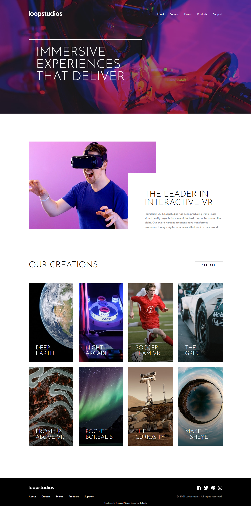
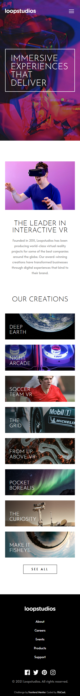

# Frontend Mentor - Loopstudios landing page solution

This is a solution to the [Loopstudios landing page challenge on Frontend Mentor](https://www.frontendmentor.io/challenges/loopstudios-landing-page-N88J5Onjw). Frontend Mentor challenges help you improve your coding skills by building realistic projects.

## Table of contents

- [Overview](#overview)
    - [The challenge](#the-challenge)
    - [Screenshot](#screenshot)
    - [Links](#links)
- [My process](#my-process)
    - [Built with](#built-with)
    - [What I learned](#what-i-learned)
- [Development](#development)
- [Author](#author)

## Overview

### The challenge

Users should be able to:

- View the optimal layout for the site depending on their device's screen size (375px / 1440px designs, responsive from 320px)
- See hover states for all interactive elements on the page

### Screenshot

| Desktop                              | Mobile                             |
| ------------------------------------ | ---------------------------------- |
|  |  |

### Links

- Solution URL: [Vercel](https://loopstudios-landing-page-main-beryl.vercel.app/)
- Live Site URL: [mmalabugin.ru/Loopstudios](https://mmalabugin.ru/Loopstudios/)

## My process

### Built with

- Semantic HTML5 markup
- CSS custom properties, Flexbox and CSS Grid
- [Astro](https://astro.build/) 5 — fully static output, scoped component styles, zero JS shipped except a tiny vanilla script for the mobile menu
- Local Alata & Josefin Sans woff2 subsets with `font-display: optional` and `<link rel="preload">` to avoid font-swap layout shift
- Animated hover states: sliding underline for nav links and social icons (scaleX ::after), inverting SEE ALL button, and a white veil + black title + lifted socials on the creation cards
- Pixel-perfect layout: the design JPGs were overlaid on the rendered page with `mix-blend-mode: difference`, and residual offsets were measured with canvas cross-correlation of row/column brightness profiles until every anchor (hero box, headings, grid, footer rows) hit 0±1px on both the 1440px and 375px designs — total page heights match the mockups exactly (2896px / 3217px)

### What I learned

- The mockup's hero photo is darkened with a **40% black overlay on desktop only** — sampling design pixels against the raw `image-hero.jpg` gives a uniform `alpha = 0.40`, while the mobile jpg is already pre-darkened and needs no overlay.
- The creations grid is actually **1113px wide** (4×256px cards, ~29.3px gaps) — 3px wider than the 1110px container the rest of the page uses; the SEE ALL button right-aligns to the grid edge, not the container.
- Card titles can't reproduce the mockup's line breaks with pure width-based wrapping: browser metrics make "THE GRID" (149px) require wrapping while "ABOVE VR" (163px) must stay on one line — impossible with one wrap width, so the breaks are hard-coded `<br>`s. Same for the hero heading: `<br class="m-br">` is `display: none` on desktop and `inline` on mobile to split "THAT / DELIVER" only at 375px.
- Astro's scoped styles get higher specificity than plain global classes via the `data-astro-cid` attribute — a scoped `.mobile-menu ul { width: 100% }` silently beat the global `.container` width and pinned the menu links to the screen edge.
- Astro's **dev toolbar** (`<astro-dev-toolbar>`) renders into every dev-mode page and photobombs Playwright screenshots as a floating pill; it's absent from production builds, so screenshots must either remove the element or be taken from a build.
- `import.meta.env.BASE_URL` is the one true way to prefix public assets (images, fonts, favicon) so the same code works at `/` on Vercel and at `/Loopstudios/` behind the shared ingress; `@font-face` with a dynamic base needs an inline `<style set:html>` block since url() in bundled CSS can't interpolate it.

## Development

```bash
npm install
npm run dev     # http://localhost:4321
npm run build   # astro build → dist/
```

Deploy convention: `main` targets Vercel (the `base` line in `astro.config.mjs` stays commented). The `deploy` branch enables `base: '/Loopstudios/'` and is built by Jenkins into a Docker image (nginx) deployed to Kubernetes behind the shared Traefik ingress (`ingresses` repo).

## Author

- Website - [mmalabugin.ru](https://mmalabugin.ru/)
- Frontend Mentor - [@1t1sCooL](https://www.frontendmentor.io/profile/1t1sCooL)
- Twitter - [@vi_el_mar](https://www.twitter.com/vi_el_mar)
- Telegram - [@ItIsCooL](https://t.me/ItIsCooL)
